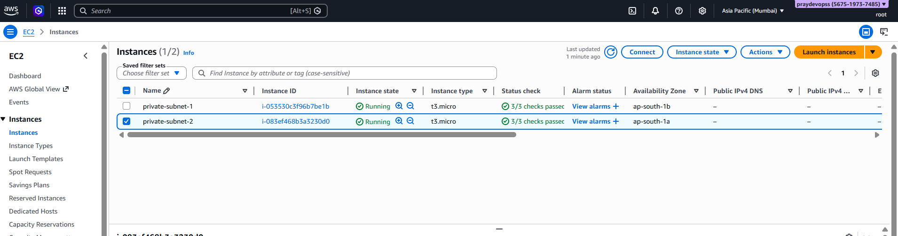

# Highly Available and Scalable Multi-AZ VPC Architecture on AWS

## Project Overview

This project demonstrates how to create a highly available and scalable multi-AZ VPC architecture on AWS.

To improve resiliency, we deploy the servers in two Availability Zones, by using an Auto Scaling group and an Application Load Balancer. For additional security, we deploy the servers in private subnets. The servers receive requests through the load balancer. The servers can connect to the internet by using a NAT gateway.

- The VPC has public subnets and private subnets in two Availability Zones.

- Each public subnet contains a NAT gateway and a load balancer node.

- The servers run in the private subnets, are launched and terminated by using an Auto Scaling group, and receive traffic from the load balancer.

- The servers can connect to the internet by using the NAT gateway.

## Project Architecture

<Frame>

</Frame>

## Project Implementation

### Create a VPC

1. Go to the AWS Management Console.
2. Navigate to the VPC service.
3. Click on "Create VPC".
4. Enter the following details:
    - select vpc and more options.
    - Name: "project"
    - CIDR block: "10.0.0.0/16"
    - Availability Zones: "ap-south-1a, ap-south-1b"
    - Nat Gateway: " 1 per AZ"
    - VPC Endpoint: "None"
    - Click on "Create VPC".

 

### Create a auto scaling group

1. Go to the AWS Management Console.
2. Navigate to the EC2 service.
3. Click on "Auto Scaling Groups".

4. Create a Launch Template.
  - Give Launch template name and description
    
  - give Application and OS Images (Amazon Machine Image) - required and Instance Type as "t3.micro"
   
  -  Provide key pair and network settings
    
  - Create Launch Template.
5. Once the launch template is created, select it in Launch template of Auto Scaling Group.
  
6. Choose instance launch option here select the 'vpc' and availability zones as "ap-south-1a, ap-south-1b" which is private subnets.
  
7. Configure group size and scaling
    - Desired capacity: 2
    - Minimum capacity: 1
    - Maximum capacity: 4
    
8. Launch configuration created successfully.
9. When we click on EC2 we will see two instances in the private subnets.

10. These instance will not have a public ip address because they are in the private subnets.
11. We will create a bastion-host in the public subnet to connect to the instances.
    - Go to the AWS Management Console.
    - Navigate to the EC2 service.
    - Click on "Instances".
    - Click on "Launch Instance".
    - DO the configuration and make sure in network settings vpc is selected as "project" and subnet is selected as "public-subnet".
    - Auto-assign public ip: "enable"
    - Create instance.
    - Once the instance is created, we will see the instance in the public subnet.
    
